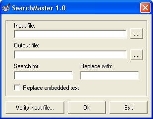



## SearchMaster

### Description

A search and replace application showing how to use FileSystemObjects to work with files and how to use command parameters. It's take a file, search for a pattern and replace to a new file.
 
### More Info
 

             |
---                |---
**Submitted On**   |2002-01-13 03:09:22
**By**             |[Luciano Najimovich](https://github.com/Planet-Source-Code/PSCIndex/blob/master/ByAuthor/luciano-najimovich.md)
**Level**          |Advanced
**User Rating**    |5.0 (20 globes from 4 users)
**Compatibility**  |VB 6\.0, VB Script
**Category**       |[Complete Applications](https://github.com/Planet-Source-Code/PSCIndex/blob/master/ByCategory/complete-applications__1-27.md)
**World**          |[Visual Basic](https://github.com/Planet-Source-Code/PSCIndex/blob/master/ByWorld/visual-basic.md)
**Archive File**   |[SearchMast485121132002\.zip](https://github.com/Planet-Source-Code/luciano-najimovich-searchmaster__1-30782/archive/master.zip)

